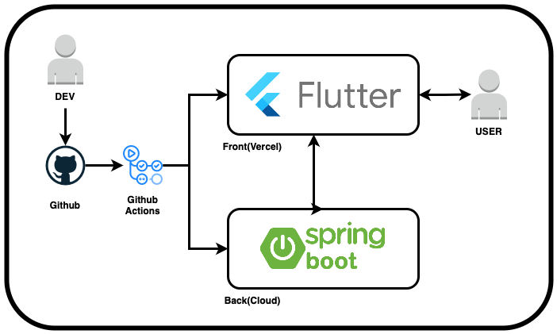

<div align="center">

# 🏝️ **제주 청년 갭이어 프로젝트**

## ✨ **일하영** ✨
*제주 청년–자영업자 일거리 연결 플랫폼*

</div>

---

## 👥 **팀 소개**

<div align="center">

### 🌟 **Team**

|    👤 **이름**     | 🎯 **역할** | 💬 **한마디**               |
|:----------------:|:----------:|:-------------------------|
|     **이기연**      | `🔧 DevOps` | *"오늘 뭐 먹지? 알고니찜 먹어야지 ~"* |
|     **박경덕**      | `💻 Backend` | *"어제 뭐 먹었지? 냉삼 먹었구나 ~"*  |
|     **정가연**      | `🎨 Frontend / Design` | *"내일 뭐 먹지? 초밥 먹어야지 ~"*   |

</div>

---

## 🎯 **서비스 개요**

**목표**: 제주 지역 자영업자와 청년 구직자를 연결하는 '채용부터 근태관리까지 가능한 인력 관리 플랫폼'을 개발하여, 지역 내 실질적인 일자리 문제를 디지털로 해소하고자 함

### 🔥 **핵심 기능**
- 자영업자용 인력 채용 공고 등록
- 구직 청년의 일자리 탐색 및 지원
- 출퇴근 확인
- 자동 급여 계산 및 근무 내역 확인
- 대체 인력 탐색 요청 기능
- 오름지수(신뢰도 지수) 기반 매칭 기능

---

## 🏗️ **시스템 아키텍처**

<div align="center">

*개발 간소화를 위해 무료 플랫폼 기반으로 설계*  
*추후 자영업자 대상 테스트 시, 반응형 웹 우선 대응*



</div>

### 🧱 **소프트웨어 아키텍처 구성**
- **프론트엔드**: `Flutter`
- **백엔드**: `Kotlin Spring Boot`
- **DB**: 개발 초기는 `NoSQL` 사용, 추후 서비스 배포 시 관계형 DB로 전환
- **CI/CD**: `GitHub Actions` (자동 배포), `Vercel`, `Cloud(Oracle/AWS)`
- **디자인**: `Figma` (프로토타입 및 사용자 흐름 설계)

---

## 📌 **주요 USE CASE**

### 🏪 **자영업자 (고용자 기준)**
1. 로그인 후 채용 공고 등록 (근무지, 시간, 조건)
2. 지원자 열람 및 채용 확정
3. 근무일 출퇴근 확인 및 근무 내역 확인
4. 급여 자동 계산 및 저장
5. 결근 시 대체 인력 요청
6. 일정 근무자에게 포인트 지급 → 지역화폐 연계
7. 근로자의 오름지수 확인 후 채용 결정

### 👨‍💼 **청년 구직자 (근무자 기준)**
1. 로그인 후 인근 일거리 검색
2. 공고 열람 및 지원
3. 근무 시작 시 위치 기반 출근 확인
4. 마감 후 퇴근 처리 → 근무 내역 확인
5. 누적 포인트 확인 및 사용 가능 매장 보기
6. 오름지수 확인 → 평판 관리 가능

---

## 📋 **요구사항 정의서**

### 기본 요구사항
- 체류 일정 기반 근무 추천 기능
- 위치 기반 공고 제공(필터링)
- 반복 근무자 관리 기능(기존 근무이력 있는 근무자 북마크)
- 출결 체크 기능
- 오름지수 시스템(근무 종료시점 상호 평가)
- 급여 산정 지원 기능
- 빈 시간대 공고 원터치 등록(대체 근무자 구인 목적)
- 모바일 우선 UI 설계

### 제약사항
- 초기 숙련 근로자 부족 가능성
- 수요 시즌성 편차 존재
- 기존 플랫폼(당근 등)과 차별화된 UX 필요

---

## 📋 **기능 명세서**

### 🧍 STAFF(근로자)

| 기능명 | 상세 설명 |
|--------|------------|
| 맞춤형 일자리 탐색 | 체류 일정/위치 기반 공고 제공 |
| 간편 지원 | 프로필 기반 원클릭 지원 |
| 지원 이력 관리 | 지원 내역 확인 |
| 출결 체크 | 출결 기록 |
| 근태 이력 조회 | 개인 캘린더 기반 출결 확인 |
| 오름지수 확인 | 출결/평가 기반 신뢰도 지수 표시 |

### 🧑‍💼 MANAGER(자영업자)

| 기능명 | 상세 설명 |
|--------|------------|
| 구인 공고 등록 | 하루 단위 일정 등록 |
| 대체 인력 모집 | 빈 시간대 원터치 공고 재등록 |
| 반복 근무자 저장 | 숙련 근로자 저장 후 재채용 활용 |
| 출결 확인 | 근무 출결 내역 확인 |
| 인사 리포트 | 근무 현황 리포트 제공 |
| 급여 정산 가이드 | 급여 계산 + 공제 안내 |
| 오름지수 확인 | 근로자 신뢰지수 기반 채용 판단 |

### 🏞️ 공통 시스템 기능

| 기능명 | 상세 설명 |
|--------|------------|
| 오름지수 | 출결률, 평가, 근무 누적 시간 반영 |
| 시즌성 UI | 시즌별 인기 공고 제공 |
| 공고 템플릿 | MANAGER 공고 서식 저장/불러오기 |

---

## 🧭 **MVP용 UX 플로우**

```plaintext
[STAFF]
- 서비스 접속 → 체류 일정 입력
    ↓
- 맞춤형 일자리 추천 리스트 확인
    ↓
- 공고 클릭 → 간편 지원 (원클릭)
    ↓
- 근무 확정 → 근무 출결 체크
    ↓
- 근무 종료 → 자동 리뷰 작성 → 오름지수 갱신
    ↓
- 포인트 적립 → 가맹점 사용

[MANAGER]
- MANAGER 로그인 → 대시보드 진입
    ↓
- 빈 시간대 공고 등록 (템플릿 활용)
    ↓
- 지원자 확인 (오름지수 우선 노출)
    ↓
- 채용 확정 → 근무자 출결 확인
    ↓
- 인사 리포트 확인 → 급여 정산 가이드 활용
    ↓
- 리뷰 작성 → 반복 근무자 저장

[MANAGER - 당일 결원 발생 시 긴급 대체 인력 구인 플로우]
- 근무자 결원 알림 수신 (당일 아침 또는 출근 전)
    ↓
- MANAGER 대시보드 → '긴급 대체 요청' 버튼 클릭
    ↓
- 현재 시간 + 근무 예상 시간 기반 긴급 공고 자동 생성
    ↓
- '반복 근무자 + 오름지수 높은 순' STAFF에게 푸시 알림 발송
    ↓
- 지원자 실시간 확인 → 빠른 채용 확정
    ↓
- 근무 시작 시점까지 출결/근무 정상 처리